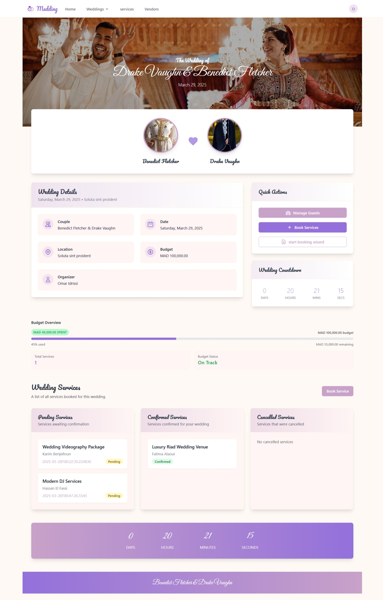

Medding - Wedding Planning Platform
=========================================

A comprehensive wedding planning platform built with Spring Boot and React, designed to connect wedding organizers with vendors and streamline the wedding planning process.

## Overview

Medding is a modern web application that facilitates wedding planning by providing a platform where:
- Wedding organizers can manage their events
- Vendors can showcase their services
- Organizers can book services for weddings
- Administrators can verify vendors and manage the platform

## Architecture

The application follows a layered architecture:

- **Frontend**: React-based SPA
- **Backend**: Spring Boot REST API
- **Database**: MySQL/PostgreSQL

### Key Features

- **Vendor Management**
    - Vendor registration and verification
    - Service listing and management
    - Review and rating system

- **Wedding Planning**
    - Wedding creation and management
    - Service booking system
    - Budget tracking

- **User Management**
    - Role-based access control
    - Secure authentication
    - User profiles

## Application Interface

### Landing Page
- Modern, welcoming design with hero section
- Featured wedding services and testimonials
- Quick access to wedding creation and vendor listings


### Wedding Planning Dashboard
- Interactive wedding planning tools
- Budget tracking
- Timeline visualization for important dates




### Vendor Profiles
- Detailed vendor information and services
- Rating and review system
- Photo galleries and pricing details
- Direct booking functionality


### Service Booking Interface
- Easy-to-use service selection process
- Availability checker
- Booking confirmation workflow


### User Authentication
- Secure login and registration system
- Role-based access control
- Profile management features


## Technology Stack

### Backend
- Spring Boot 3.x
- Spring Security with JWT
- Spring Data JPA
- MapStruct for DTOs
- Lombok
- Maven

### Frontend
- Angular 17
- TypeScript
- Ngrx for state management

### Database
- PostgreSQL

## Getting Started

### Prerequisites
- Java 17 or higher
- Angular 17 or higher
- Node.js 16 or higher
- Maven 3.x
- PostgreSQL database

### Backend Setup

1. Clone the repository:
```bash
git clone https://github.com/MesVortex/Medding.git
```

2. Navigate to the backend directory:
```bash
cd medding/back-end
```

3. Configure the database in `application.yml`

4. Run the application:
```bash
mvn spring-boot:run
```

### Frontend Setup

1. Navigate to the frontend directory:
```bash
cd medding/front-end
```

2. Install dependencies:
```bash
npm install
```

3. Start the development server:
```bash
npm start
```

### Key Endpoints

- `/api/auth/*` - Authentication endpoints
- `/api/vendors/*` - Vendor management
- `/api/weddings/*` - Wedding management
- `/api/reviews/*` - Review system
- `/api/bookings/*` - Booking management

## Testing

### Running Backend Tests
```bash
mvn test
```

### Running Frontend Tests
```bash
npm test
```

## Project Structure

```
medding/
├── back-end/
│   ├── src/
│   │   ├── main/
│   │   │   ├── java/
│   │   │   └── resources/
│   │   └── test/
│   └── pom.xml
├── front-end/
│   ├── src/
│   ├── public/
│   └── package.json
└── README.md
```

## UML Diagrams

### Class Diagram

visit [here](https://lucid.app/lucidchart/9703b2f8-c30e-40b5-ae40-741fc34f376c/edit?invitationId=inv_1e3da47f-71ff-4dd7-830d-4eb55a1c21f7&page=0_0#) to see the class diagram

### Use Case Diagram

visit [here](https://lucid.app/lucidchart/fadd090a-9ac0-4a8d-91af-64bcef458d2d/edit?viewport_loc=-577%2C327%2C4316%2C1676%2C.Q4MUjXso07N&invitationId=inv_acc16a90-0ed0-4266-84c0-3cb6c227a6eb) to see the use case diagram

## Planning

Jira is used for planning and tracking the progress of this project. You can view Jira board [here](https://meskinemsoatafa.atlassian.net/jira/software/projects/MD/boards/20/backlog).

## Presentation

Project presentation is made using canva. You can view it [here](https://www.canva.com/design/DAGi-nRoF6E/KSsHy7XeiZF6bKh-0P6CLQ/edit?utm_content=DAGi-nRoF6E&utm_campaign=designshare&utm_medium=link2&utm_source=sharebutton).

## Authors

- **Meskine Mostafa** - *full-stack web developer* - [Meskine Mostafa](https://github.com/MesVortex)
